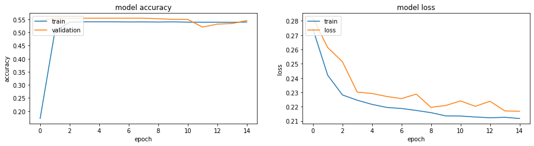
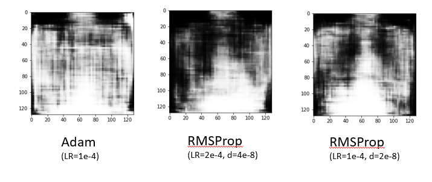

<h1> Multi-Label Chest X-Ray Classification and GAN for Handling Imbalanced Dataset 

<h2> Problem Statement: </h2> 
Build Multi-Label classifier and improve training with synthetic images of disease classes to boost their representation and improve disease prediction accuracy

<h2> Dataset </h2>
NIH Chest X-Ray multi-label dataset. Note it demonstrates common problem of data imbalance. Link: https://www.kaggle.com/nih-chest-xrays/data and https://www.kaggle.com/nih-chest-xrays/sample
<h2> Data Distribution </h2>

  

<h2> Benefits: </h2>

- Computer aided diagnosis

- Assist radiologists and pathologists as they use medical imaging to diagnose a wide variety of heart and lung conditions.

<h2> Densenet169 (without Data Augmentation) </h2>

  

<h2> Keras:ImageDataGenerator (Data Augmentation) </h2>

  

<h2> DCGAN (Data Augmentation) </h2>

  

<h2> Limitations </h2>

- Multi-label classifier training limited to sample dataset due to hardware limitations.
- The image labels were NLP extracted, so few labels could be erroneous.
- Keras ImageDatagenerator doesn't address imbalance.
- No radiology or medical expertise.

<h2>Future Work </h2>

- Improve quality of GAN synthetic images. 

- Provide more than the sample subset of data for classifier training.

